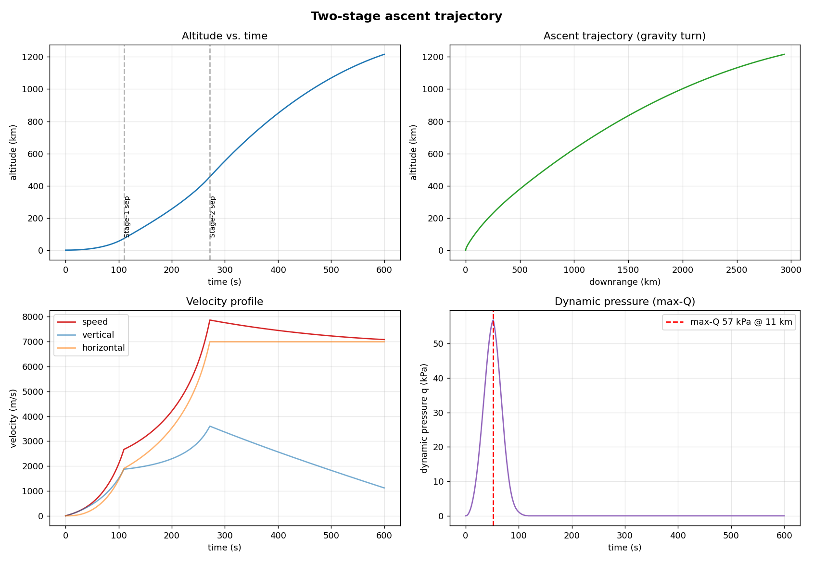

# Rocket Stage Ascent Trajectory Simulation

A 3-DOF launch-vehicle ascent simulator: it integrates a multi-stage rocket from
the pad to orbit through the real atmosphere, using a **gravity-turn** steering
law, and validates its own propulsion core against the **ideal rocket equation**
to machine precision. It then runs a **trade study** — sweeping the pitch-over
angle to show how steering trades final velocity against apogee — so the tool
answers a design question, not just draws one trajectory.



## What it models

- **Multi-stage flight** with clean staging: each stage burns until propellant
  depletion, its dry mass is jettisoned, and the next stage ignites. The mass
  discontinuity at separation is handled by integrating stage-by-stage rather
  than in one continuous run.
- **Gravity-turn steering**: the vehicle rises vertically, receives a small
  pitch kick, then lets thrust follow the velocity vector while gravity naturally
  bends the path toward horizontal — the fuel-efficient ascent real launchers use.
- **Standard atmosphere (1976)** giving altitude-dependent density and pressure,
  driving both aerodynamic drag and nozzle back-pressure thrust correction.
- **Inverse-square gravity** that weakens with altitude.
- **Max-Q** (peak dynamic pressure) extracted automatically.

## Validation first

The single most important check for trajectory code is the **Tsiolkovsky rocket
equation**: with gravity and drag removed and thrust straight up in vacuum, the
velocity gained over a burn must equal `Isp · g₀ · ln(m₀/m_f)`. The simulator
reproduces it to a relative error of ~10⁻¹⁵ — machine precision. That anchor
means any velocity shortfall in the full trajectory is cleanly attributable to
gravity and drag losses, which is exactly the decomposition to explain in an
interview.

```
Stage-1: ideal 3786.1 m/s, numeric 3786.1 m/s, rel err 4.7e-15
Stage-2: ideal 6034.8 m/s, numeric 6034.8 m/s, rel err 2.7e-14
```

## Quickstart

```bash
git clone https://github.com/yuvraj2815/rocket-ascent-trajectory.git
cd rocket-ascent-trajectory
python -m venv venv && source venv/bin/activate
pip install -r requirements.txt

python scripts/run_simulation.py
```

This prints the validation and baseline numbers and writes all plots to
`results/`.

## Baseline result (demo two-stage vehicle)

| Quantity | Value |
|----------|-------|
| Apogee | ~1,200 km |
| Max speed | ~7,860 m/s |
| Max-Q | ~57 kPa at ~11 km |
| Stage-1 separation | 72 km, 2,670 m/s |
| Stage-2 separation | 455 km, 7,860 m/s |

## The trade study


Sweeping the pitch-kick angle reveals a real design tension: max speed climbs
with a steeper kick up to ~9–10°, then collapses if the vehicle pitches over so
aggressively it turns horizontal too early and falls back into the atmosphere;
apogee falls monotonically as more energy is directed horizontally. The "best"
kick is a balance, and the simulator lets you find it.

## Project structure

```
rocket-ascent-trajectory/
├── src/
│   ├── atmosphere.py     # U.S. Standard Atmosphere 1976 (density, pressure)
│   ├── vehicle.py        # Stage / Vehicle definitions, mass & TWR bookkeeping
│   ├── trajectory.py     # 3-DOF integrator: gravity turn, staging, drag, max-Q
│   └── validation.py     # ideal-rocket-equation cross-check
├── scripts/
│   └── run_simulation.py # runs baseline + plots + trade study
├── results/              # committed plots + trade-study CSV
├── tests/
│   └── test_trajectory.py
├── requirements.txt
└── README.md
```

## The physics, briefly

State vector `[x, h, vx, vh, m]` — downrange, altitude, horizontal and vertical
velocity, and mass. Forces per unit mass: thrust along the velocity vector
(pressure-corrected), inverse-square gravity down, and drag `½·ρ·v²·Cd·A` opposing
motion. Integrated with `scipy.integrate.solve_ivp` (RK45) using terminal events
to detect burnout and ground impact.

## Running the tests

```bash
pytest -q
```
Tests cover the atmosphere model, the rocket-equation validation, liftoff TWR,
staging behaviour, and max-Q realism.

## Notes

- The demo vehicle is illustrative (small-launcher scale), tuned so liftoff TWR
  exceeds 1 and the ascent is physically representative. Swap in real stage
  masses/thrusts in `vehicle.py` to model a specific rocket.
- This is a planar, flat-Earth-with-altitude-gravity model — appropriate for
  ascent analysis and trade studies, not for orbital insertion accuracy.
